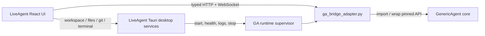
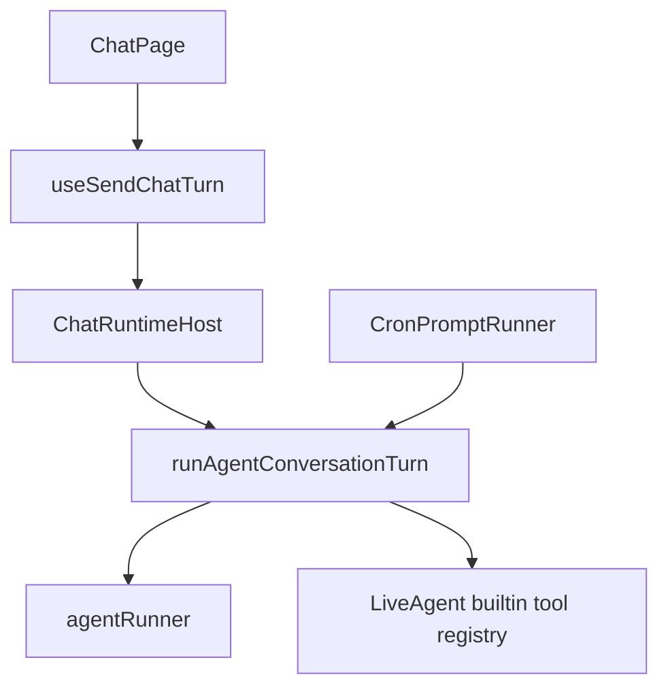
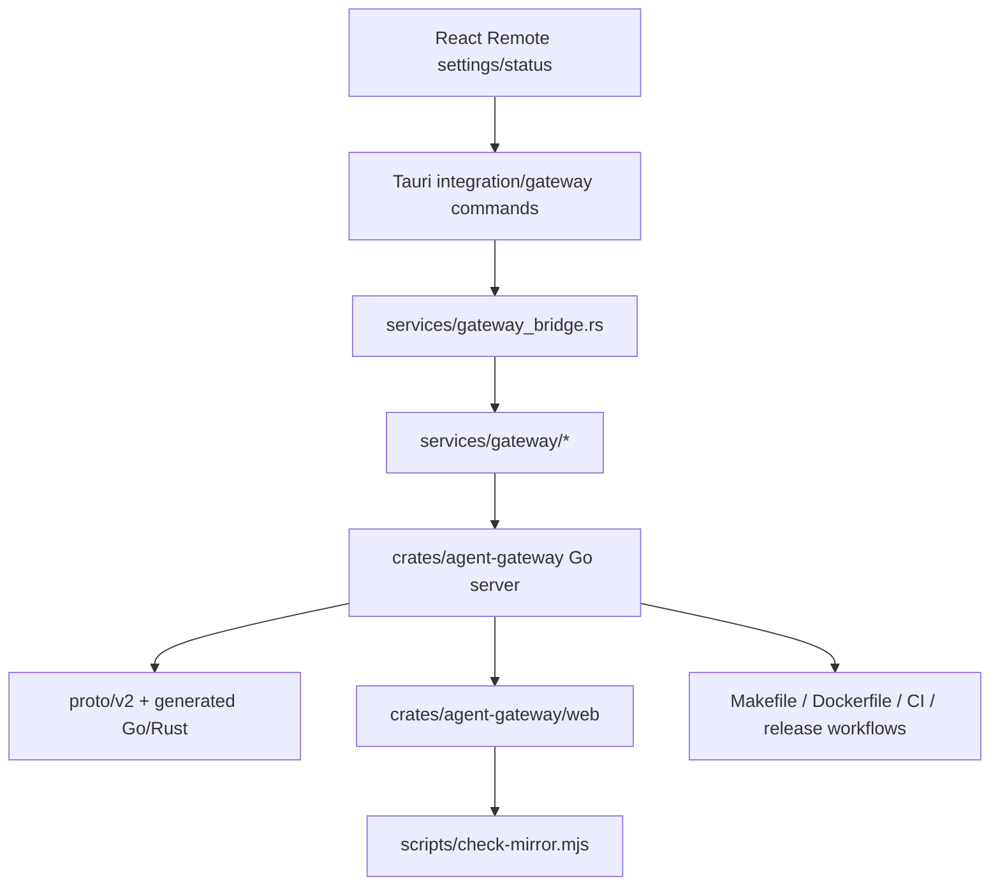
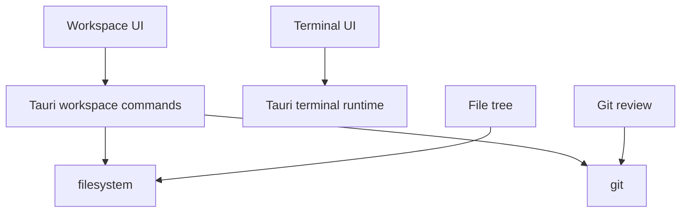

# Phase 0 Dependency and Ownership Map

This map is a removal and adaptation guide, not a license to delete files. Phase 6 must regenerate an exact deletion list and obtain approval before deleting more than three files.

## Target boundary

Agent semantics cross only the adapter boundary. React must not call models or execute a second Agent Loop. Pure desktop features remain Tauri-owned.

## A. Legacy Agent runtime — replace, then remove

### Primary frontend execution path

High-signal locations discovered by static symbol scan:

- `crates/agent-gui/src/pages/chat/turns/runAgentConversationTurn.ts` — main legacy turn loop and tool dispatch.
- `crates/agent-gui/src/pages/chat/runtime/ChatRuntimeHost.ts` — lifecycle host coupled to the old loop.
- `crates/agent-gui/src/lib/chat/runner/agentRunner.ts` — model/agent runner boundary.
- `crates/agent-gui/src/components/cron/CronPromptRunner.tsx` — second entry into Agent execution.
- `crates/agent-gui/package.json` — direct dependencies on `@earendil-works/pi-agent-core` and `pi-ai`.

Replacement rule: `GaChatRuntimeHost` owns session/turn orchestration and talks only to the typed Bridge client. Existing visual transcript components may remain. Production references to `runAgentConversationTurn` and the builtin registry must reach zero before deletion.

## B. Gateway / remote subsystem — remove after MVP

High-signal frontend locations:

- `crates/agent-gui/src/pages/settings/RemoteSection.tsx`
- `crates/agent-gui/src/pages/chat/gateway/*`
- `crates/agent-gui/src/pages/chat/runtime/useSendChatTurn.ts`
- `crates/agent-gui/src/lib/settings/sync.ts`

High-signal Tauri locations:

- `crates/agent-gui/src-tauri/src/services/gateway_bridge.rs`
- `crates/agent-gui/src-tauri/src/services/gateway/*`
- `crates/agent-gui/src-tauri/src/commands/integration/gateway.rs`
- `crates/agent-gui/src-tauri/src/services/tunnel/*`
- Gateway registration and command wiring in `src-tauri/src/lib.rs`

Standalone and build-chain ownership:

- `crates/agent-gateway/` — Go service, tests, Proto, generated code, and Browser WebUI.
- `Dockerfile`, `railway.json`, Gateway targets in `Makefile`.
- `.github/workflows/gateway-docker.yml` and Gateway/WebUI jobs in CI.
- Proto generation and mirror/release scripts.

Important false-positive rule: a broad `gateway|remote|proto` search also matches generic Git remotes, remote branches, remote paths, and dependencies such as `prost`. Every residual must be classified by ownership; do not bulk-delete by keyword.

## C. Pure desktop capabilities — preserve

Representative preserved locations:

- React workspace orchestration: `src/pages/chat/workspace/*`.
- File tree: `src/components/project-tools/file-tree/*`.
- Git review: `src/components/project-tools/git-review/*` and `src/components/git/GitBranchSelector.tsx`.
- Terminal client/UI: `src/lib/terminal/*`, `src/pages/chat/workspace/useProjectTerminals.tsx`, related workspace overlays.
- Tauri filesystem/Git: `src-tauri/src/commands/workspace/fs.rs`, `git.rs`, and adjacent workspace command modules.
- Tauri terminal: `src-tauri/src/commands/runtime/terminal.rs`, `src-tauri/src/runtime/terminal/*`.
- Window, tray, updater, theme, i18n, and local settings that are not Agent-semantic truth.

Caveat: some desktop modules currently contain Gateway transport branches (notably terminal/SFTP/workspace code). Preserve the local implementation while surgically removing remote branches only after call-site tests prove separation.

## D. New integration seams

| Layer | New seam | Owns | Must not own |
|---|---|---|---|
| Python | `runtime/ga/ga_bridge_adapter.py` | protocol versioning, auth, Origin/CORS, DTO normalization, redaction | second Agent Loop |
| Rust | `services/ga_runtime/*` | path discovery, manifest, dynamic port/token, process lifecycle, health/logs | model/tool semantics |
| React | `src/lib/ga-bridge/*` | typed client, WS reconnect, DTO parsing, redaction | credentials or Agent execution |
| React | `GaChatRuntimeHost.ts` | UI lifecycle, snapshot hydration, event mapping | authoritative session state |

## E. Static gates for later phases

Before Phase 6 deletion, require:

1. No production entry calls `runAgentConversationTurn` or the legacy builtin registry.
2. Session, model, history, skill, memory, Hook, and Automation state all originate from GA APIs.
3. Local workspace/file/Git/terminal smoke tests pass without Gateway services.
4. Full-repository residual search for `gateway|remote|proto|runAgentConversationTurn|builtinRegistry` is classified line by line as remove, preserve-local, dependency-name, or documentation.
5. Each deletion group is independently buildable/testable and committed separately.
